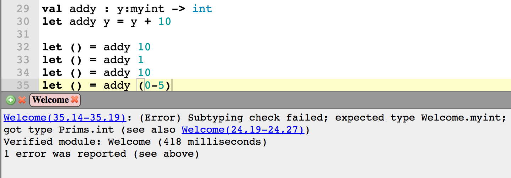

# Make Love! The lojikil way: use'ing more types more'er good

## a cactus con preview

---
<!-- page_number: true -->
<!-- footer: @lojikil -->

# *Types*

## The Basics:

- `int`
- `float`
- `string`
- sum types ((un)tagged unions), product types (records, tuples)

---

# *Types*

## More Advanced

- State: is the descriptor opened or closed?
- Authenticity: did Stefan generate this DS on his machine?
- Resentment: why did Stefan make me listen to another types talk?

_yes, this is indeed a Sartre joke._

---

# *Types*

## More Advanced

- State: typeful/effectful typing, monadic/monoidal/comonadic
- Authenticity: authenticated data structures
- Resentment: stringly typed

but what about the middle ground?

---

# *Types*

What if we want to _refine_ a type? 

---

# Quick Segway: Curry-Howard

- remember: Curry-Howard shows that programs are _isomorphic_ to logic
- This **also** means that types are _catamorphic_ to logic
	- that is to say, types are a _category_ of logic

---

# *Refinement Types*

- defines a _refinement_ over a _type_
- basically, creates a subtype of a super type, with some restriction

---

# *Refinement* Example

- we want to add two numbers
- but they have to be > 10

```
let canAdd x = x > 10

val myAddFun : x:int{canAdd x} y:int{canAdd y} -> int
```

---

# What in the actual fuck loji?

Ok, so this is uh... F\*, a dependently typed language from MSR

- `canAdd` has the type `Totalprim int -> Totalprim boolean`
- "Total": `forAll x in X thereExists y in Y | x -> y`

---

# No like, seriously... what in the actual fuck

- `x:int{canAdd x}` defines a _refinement_
- basically this is a subtype of integers
- mathematically, it says `x in Int | x > 10`
- but why do we care?

---

# We care because

- Static checks
- Dynamic checks
- Basically, our business logic becomes both standard & centralized

---

# Refinements *as* types

- Best controls are: standard & centralized
- require little or no effort for programmers

```
type myint = x:int{canAdd x}

val addy : y:myint -> int
```

- refinement `canAdd` applied across all calls to `myAddFun`

---

# Refinements *as* types



---

# _squinting_ Those look like annotations...

- pretty close
- enforced by the _compiler_
- when cannot be statically enforced, dynamically checked
	- obvs changes your execution profile
- have some other nice properties 
    - can choose type equivalence: `XSSString` == `String`?
    - light weight: _mostly_ erased at compile time

---

# Use Cases

- cryptographic equivalence
    - require that `p === q mod a`
    - require keys be a specific length
- Unsafe string handling: SQLi, XSS, RCE, &c.
- Access Control

---

# Let's Fix Access Control

- constant bugbear: IDOR, MFLAC, &c &c &c
- use types to fix and compiler to enforce 
- Administrative functionality for admins
- User functionality for users
- User References only accessible to one user

---

# Simple app

- admin: change any user's password 
- user change their own password
- retrieve data 

```

type User = | Unauthenticated 
            | Luser name:string -> uid:int -> user
            | AdminUser name:string -> user

val adminChangePassword : user:User passwd:string -> bool
val userChange : user:User passwd:string -> bool
val retrieveData : user:User rid:int -> String

```

---

# Problems

- `adminChangePassword` doesn't know what *kind* of user it has
- same for `userChange`
- `retrieveData` doesn't know if `user` owns `rid`

---

# Refinement

 `=>`

---

# Refinement

```
let isAdmin u = match u with
    | Admin _ -> true
    | _ -> false

let isAuthed u = match u with
    | Admin _ -> true
    | Luser _ _ -> true
    | _ -> false

(* really, docid should be something else
 * like pulled from a DB, but for now, we'll
 * do this... *)

let canRead u docid = match u with
    | Admin _ -> true
    | Luser _ uid -> uid < 50 && (uid = docid)
    | _ -> false 
```

---

# Refinement 

```
val adminChangePassword : user:User{isAdmin user} passwd:String -> bool
val userChange : user:User{isAuthed user} passwd:String -> bool
val retrieveData : user:User rid:int{canRead user rid} -> String
```

- functions now encode their access logic
- can be abstracted/extracted to top-level types
- enforced at call site

---

# One step further: model extraction

1. Define refinements & dependent types
2. model interactions with Z3/F\*
3. prove models
4. ???
5. profit

---

# That "???" is kinda big tho

- type equivalency
- type erasure
- dynamic check insertion at callsite/receive site
- prove lock-step equivalency
- generate resulting code

---

```
let rec counter_mode key iv counter len plaintext ciphertext =
  if len =^ 0ul then ()
  else if len <^ blocklen
  then (* encrypt final partial block *)
    begin
      let cipher = sub ciphertext  0ul len in
      let plain  = sub plaintext   0ul len in
      prf cipher key iv counter len;
      xor_bytes_inplace cipher plain len
    end
  else (* encrypt full block *)
    begin
      let cipher = sub ciphertext  0ul blocklen in
      let plain  = sub plaintext   0ul blocklen in
      prf cipher key iv counter blocklen;
      xor_bytes_inplace cipher plain blocklen;
      let len = len -^ blocklen in
      let ciphertext = sub ciphertext blocklen len in
      let plaintext  = sub plaintext  blocklen len in
      counter_mode key iv (counter +^ 1ul) len plaintext ciphertext
    end
```

---

# Typing

- `plaintext` and `ciphertext` are ST monads (state monads)
- transformations on ST follow monadic laws
- this results in terrible code... right?

---

```
void Crypto_Symmetric_Chacha20_counter_mode(
  uint8_t *key,
  uint8_t *iv,
  uint32_t counter,
  uint32_t len,
  uint8_t *plaintext,
  uint8_t *ciphertext
)
{
  if (len == UINT32_C(0))
  {

  }
  else if (len < Crypto_Symmetric_Chacha20_blocklen)
  {
    uint8_t *cipher = ciphertext + UINT32_C(0);
    uint8_t *plain = plaintext + UINT32_C(0);
    Crypto_Symmetric_Chacha20_prf(cipher, key, iv, counter, len);
    Buffer_Utils_xor_bytes_inplace(cipher, plain, len);
  }
  // ...
```

---

# Typing

- erasure means we can get pretty performant code
- _almost_ everything is statically proven
- minimal dynamic checks

---

# Other benefits

Maps of:

- stateful operations
- privileged
- data flow & general change
- _effectively_ for free

--- 

# Downsides

- code can be hairy for even simple proofs:

```
val append_len: l1:list 'a -> l2:list 'a
             -> Lemma (requires True)
                      (ensures (length (append l1 l2) = 
                          length l1 + length l2)))
val reverse: #a:Type -> f:(list a -> Tot (list a)){
                           forall l. l == f (f l)}
```

- quickly run into Gödel (decidability)
- requires extra tooling & languages
    - F\* is _mostly_ compatible with F# however

---

# Takeaways

- refinements extend logic to the type system
- languages can flatten term language & type language
- allows centrally-enforced logic rules 
    - assuming your rules are decidable
- can achieve relatively efficient code at cost of initial thinking
    - but programmers should be thinking about design more anyway

---

# Thanks!

## Questions?